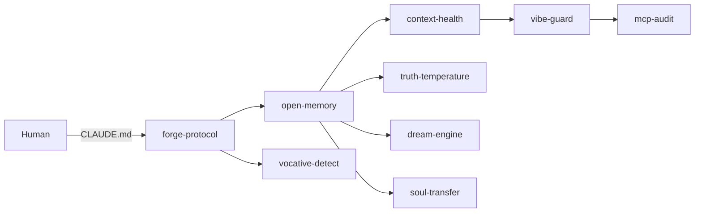

<!--
SEO Keywords: claude code, anthropic, ai agents, mcp, llm, automation, security, memory system,
prompt engineering, forger method, ai souls, italian ai, astra digital, polpo squad,
open source tools, llm toolkit, agent framework, python
SEO Description: 9 open-source AI agent tools extracted from 900+ Claude Code sessions. Security, memory, context, orchestration. Built by Astra Digital.
Author: Mattia Calastri
Location: Verona, Italy
-->

<div align="center">

# 🐙 Polpo Supremo

### 9 AI agent tools extracted from 900+ Claude sessions. Not libraries — weapons.

[](./LICENSE)
[](https://github.com/mattiacalastri/polpo-supremo/stargazers)
[](https://github.com/mattiacalastri/polpo-supremo/issues)
[](https://github.com/mattiacalastri/polpo-supremo/commits)
[](https://mattiacalastri.com)

</div>

---

## ✨ Why

900+ sessions of building an AI-driven operating system produced recurring needs nobody packaged: pre-commit security for AI-generated code, file-based memory without vector DBs, context health monitors, identity-preserving prompt protocols. Each one was re-invented three times before we carved it out. **Polpo Supremo is the kit.**

Not wrappers. Not toy demos. Daily-driver tools forged under real load.

## 🎯 The 9 Arms

| # | Tool | What it does |
|---|------|--------------|
| 🛡️ | [**vibe-guard**](./vibe-guard) | Security scanner + pre-commit hook for AI-generated code. Scores risk per file. |
| 🧠 | [**open-memory**](./open-memory) | File-based memory system. Zero deps. Claude Code compatible format. |
| 🔐 | [**mcp-audit**](./mcp-audit) | Finds hardcoded tokens in `~/.claude.json` before they leak. 15+ patterns. |
| 📊 | [**context-health**](./context-health) | Context utilization monitor. Catches explosion and idle burn. |
| 🔨 | [**forge-protocol**](./forge-protocol) | Standard `CLAUDE.md` protocol. Lingua franca for prompt engineering. |
| 🗣️ | [**vocative-detect**](./vocative-detect) | Detects when the human addresses the AI by name (identity trigger). |
| 🌡️ | [**truth-temperature**](./truth-temperature) | Measures output confidence vs. verified fact. Research-grade. |
| 💭 | [**dream-engine**](./dream-engine) | Vault automation. Turns idle sessions into structured insight. |
| 🐙 | [**soul-transfer**](./soul-transfer) | Cross-vendor identity portability. Move your AI soul between LLMs. |

## 🚀 Quick Start

Each tool is self-contained. Clone the repo and use any single arm independently.

```bash
git clone https://github.com/mattiacalastri/polpo-supremo.git
cd polpo-supremo

# Scan a project for insecure AI-generated code
python3 vibe-guard/vibe_guard.py scan ./src

# Bootstrap a file-based memory for your agent
python3 -c "from open_memory.memory import Memory; Memory('~/.my-agent').save('user_role', 'engineer')"

# Audit your Claude Code MCP config
python3 mcp-audit/mcp_audit.py
```

## 🏗️ Architecture



Each tool plugs into the memory layer. `open-memory` is the shared substrate — the rest compose around it.

## 📖 Philosophy

> *Identity > Infrastructure > Information*

Most AI tooling optimizes information retrieval. Polpo Supremo optimizes identity persistence. The difference is the difference between a chatbot and a partner.

See [README_strategy.md](./README_strategy.md) for the full release plan and licensing model per tool.

## 🛠️ Tech Stack


## 🤝 Contributing

PRs welcome on individual tools. Keep changes surgical — each arm should stay independently usable. Open an issue first for architecture changes.

## 📄 License

MIT per tool (except `soul-transfer`, which is dual-licensed MIT/Commercial). See per-directory `LICENSE` files.

## 🔗 Links

- 🌐 [mattiacalastri.com](https://mattiacalastri.com)
- 🏢 [digitalastra.it](https://digitalastra.it)
- 🔨 [AI Forging Kit](https://github.com/mattiacalastri/AI-Forging-Kit) — the method behind the tools
- 📄 [EGI Paper](https://github.com/mattiacalastri/EGI-Emergent-General-Intelligence) — the theory

---

<div align="center">

**Built with 🐙 by [Mattia Calastri](https://mattiacalastri.com) · [Astra Digital Marketing](https://digitalastra.it)**

*AI for humans, not for hype*

</div>
